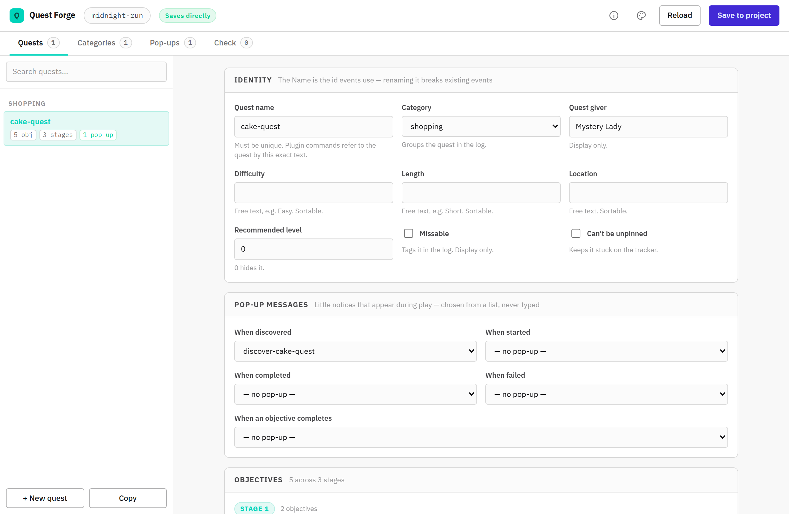
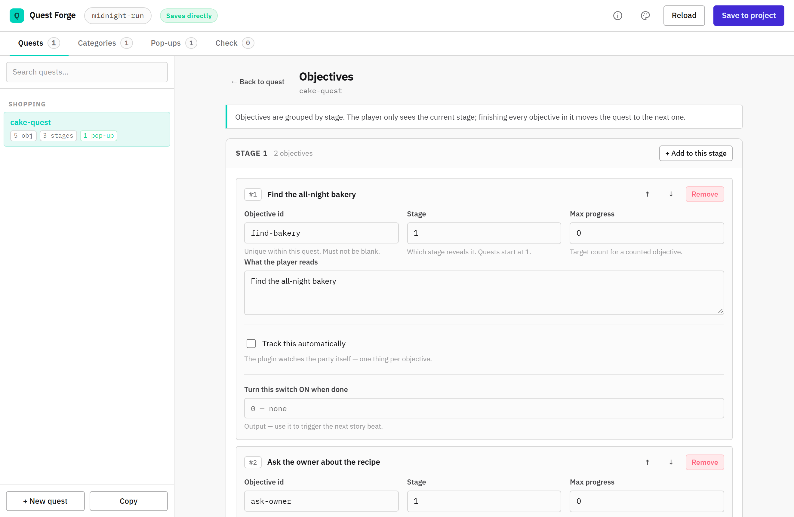
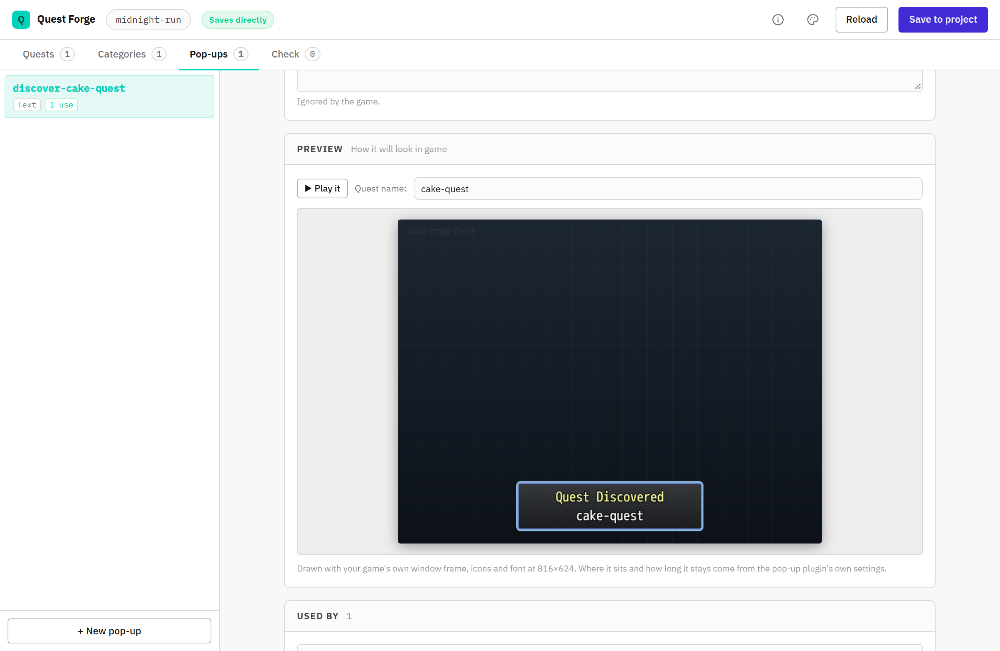
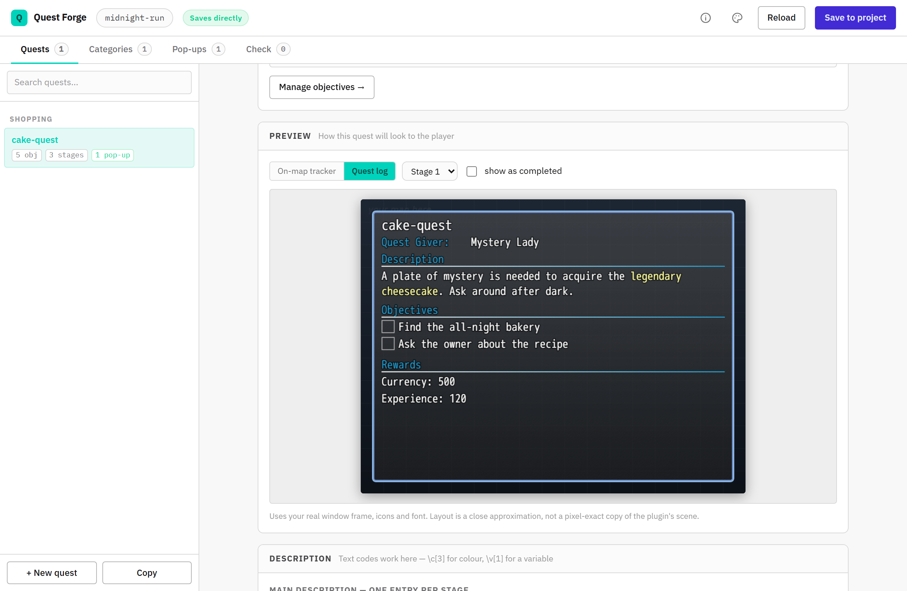
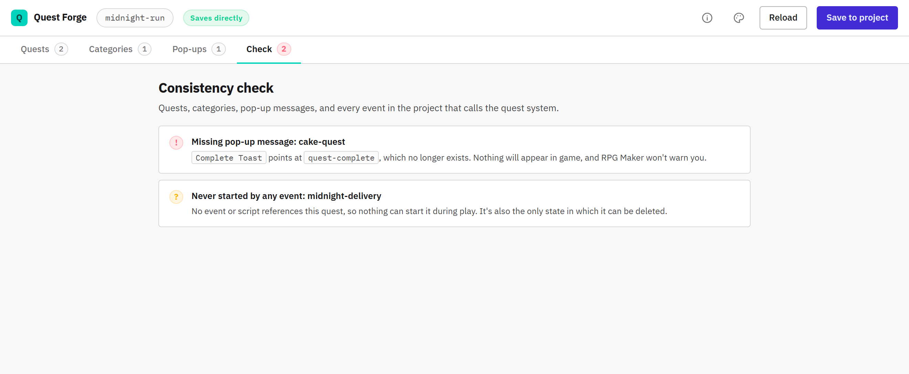
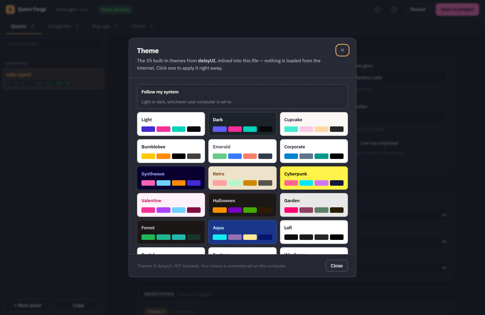

# Quest Forge

A visual editor for the **[CGMZ Quest System](https://www.caspergaming.com/plugins/cgmz/questsystem/)** in RPG Maker MZ.

Quests, objectives, rewards and pop-up notifications, edited in a real form instead of nested JSON boxes in the Plugin Manager. It's a single HTML file — open it in a browser, point it at your project, save.



> Unofficial. Quest Forge contains no plugin code; it edits the settings of plugins written by [Casper Gaming](https://www.caspergaming.com/), and is not affiliated with or endorsed by them.

---

## Why

Editing a CGMZ quest through RPG Maker's Plugin Manager means opening a list, opening a row, opening a nested list, opening another row. Objectives, descriptions and rewards are each their own JSON-in-a-string. Toast (pop-up) messages are worse: a quest points at a toast preset **by a name you type from memory**, and if it doesn't match, nothing happens — no pop-up, no error, no warning in the console.

Quest Forge flattens all of that into one screen, and makes the failure modes visible instead of silent.

---

## Quick start

Download or clone the repo, then pick one of two modes.

### Direct save (recommended)

Serve the folder and open it over `http://localhost` — browsers only grant folder access on a local server, not on `file://`.

```bash
npx --yes http-server -p 8123 -c-1 .
```

Or with Python:

```bash
python -m http.server 8123
```

Then open <http://localhost:8123/quest-forge.html> and click **Choose project folder** — pick the folder containing your project's `js/`, `data/` and `index.html`.

Quest Forge reads and writes `js/plugins.js` in place. Requires **Chrome or Edge** (File System Access API).

### Fallback (any browser)

Double-click `quest-forge.html`, then click **Load a plugins.js file instead**. You edit normally and **Save** downloads a new `plugins.js` to copy back into your project's `js/` folder.

In this mode Quest Forge can't read your maps, so event scanning, quest deletion and the game-art previews are unavailable. The header always tells you which mode you're in.

---

## What it does

### Quests

Name, category, quest giver, difficulty, length, location, recommended level and the missable/pin flags — all as plain fields. Per-stage descriptions, plus the separate unstarted / completed / failed / board texts.

### Objectives

Summarised in the quest form as a compact per-stage list, with full editing on its own screen behind **Manage objectives**. Objectives are grouped by stage, each stage has its own *Add* button, and reordering stays inside the stage it belongs to.

Automatic tracking is exposed properly: gold, item, weapon, armour, variable or switch, with the item and switch pickers searching your project's real names (`918: Got_Chan_Cake`) instead of asking for raw ids.



### Pop-up messages

The plugin and its documentation call these **toasts**. Quest Forge calls them pop-ups, because that's what they are.

The five moments a quest can fire one — discovered, started, completed, failed, objective completed — are **dropdowns populated from the pop-up messages you've actually defined**, so a name can't silently mismatch. A value pointing at a message that no longer exists is shown as `(not found)` rather than swallowed.

### Live previews

Both previews load `img/system/Window.png`, `img/system/IconSet.png` and your game's font straight from the project folder, and draw at your real screen resolution:

- **Pop-up preview** — the message on a mock game screen, positioned exactly where your plugin settings put it, with `%questname` filled in. **▶ Play it** runs the real fade-in / hold / fade-out at the configured duration.
- **Quest preview** — toggles between the on-map tracker and the quest log entry, with a stage selector and a "show as completed" switch.

Both repaint as you type. Text codes (`\c[6]`, `\i[164]`) render the way the game renders them, including colour carrying across wrapped lines.





### Visual pickers

- Icons are picked from a grid of your project's actual IconSet.
- Text colours are swatches read from your actual windowskin.
- Category header gradients use a colour picker and an opacity slider, writing the `rgba(...)` format CGMZ expects.

### Consistency check

The **Check** tab scans every `Map*.json` and `CommonEvents.json` in your project for quest-system plugin commands and script calls, then reports:

- events calling a quest that no longer exists — usually a quest renamed after the event was written
- quests nothing references, so nothing can start them
- pop-up messages referenced but not defined, and duplicate names
- duplicate quest names, blank objective ids, missing categories



### Safe deletion

**Delete quest** is always visible but only enabled when nothing points at that quest. If something does, the button is disabled and lists exactly what's holding it. If the project's events haven't been scanned, deletion stays disabled — *unknown* is treated as unsafe rather than as permission.

### Themes

35 built-in [daisyUI](https://daisyui.com) themes, inlined into the file. The picker previews each theme in its own palette. Nothing is downloaded at runtime.



---

## Requirements

| | |
|---|---|
| **Game engine** | RPG Maker MZ |
| **Required plugin** | [CGMZ Core](https://www.caspergaming.com/plugins/cgmz/core/) + [CGMZ Quest System](https://www.caspergaming.com/plugins/cgmz/questsystem/) |
| **Optional plugin** | [CGMZ Toast Manager](https://www.caspergaming.com/plugins/cgmz/toastmanager/) — needed for pop-up messages |
| **Browser** | Chrome or Edge for direct save; any modern browser for the fallback mode |

Quest Forge is one file with no build step and no dependencies. The only network request it makes is to Google Fonts for IBM Plex, with system fallbacks if you're offline.

---

## Before you save

**Close RPG Maker MZ first.** Both Quest Forge and the editor write `js/plugins.js`, and whichever saves last wins.

A timestamped backup — `js/plugins.backup-<date>.js` — is written before every direct save. If a save ever goes wrong, that file is your undo.

Your data never leaves your machine. Quest Forge has no server, no analytics and no upload; it only touches the folder you explicitly grant access to.

### On the format

`plugins.js` stores plugin settings as JSON-encoded strings, sometimes nested two levels deep. Quest Forge parses that structure and writes it back in RPG Maker's own layout: one plugin object per line. In testing against a 24-plugin project, opening and saving with no edits produced a **byte-identical file**, and text codes, quotes and newlines survive the round trip unchanged.

---

## Troubleshooting

**The folder picker doesn't appear, or is refused.** You've probably opened the file directly from disk. Serve it over `http://localhost` as shown above, or use the fallback mode.

**Changes don't show up in game.** Reopen the project in RPG Maker after saving so it reloads `plugins.js`, and test quest changes on a new save — CGMZ Quest System only partially supports adding quests to existing saves.

**A pop-up doesn't appear in game.** Check the **Check** tab. The usual causes are a message that doesn't exist, or CGMZ Toast Manager not being installed and enabled.

---

## Credits

**Plugins** — [Casper Gaming](https://www.caspergaming.com/) ([terms of use](https://www.caspergaming.com/terms-of-use/) · [Patreon](https://www.patreon.com/CasperGamingRPGM)). Quest Forge edits their plugins' settings and ships none of their code.

**Themes** — [daisyUI](https://daisyui.com) 5.7.28, MIT licensed. Only the colour palettes are used; none of daisyUI's component styles.

**Typefaces** — [IBM Plex](https://www.ibm.com/plex/) Sans & Mono, SIL OFL 1.1.

**This editor** — written with [Claude](https://claude.com/claude-code), maintained by [sageChaozu](https://github.com/sageChaozu/).

---

## License

[MIT](LICENSE). Use it, change it, ship it, fold it into your own tools — commercially or not. The only condition is that the copyright notice stays with copies of the software.

This covers Quest Forge itself. The CGMZ plugins it edits are Casper Gaming's and carry [their own terms](https://www.caspergaming.com/terms-of-use/).
